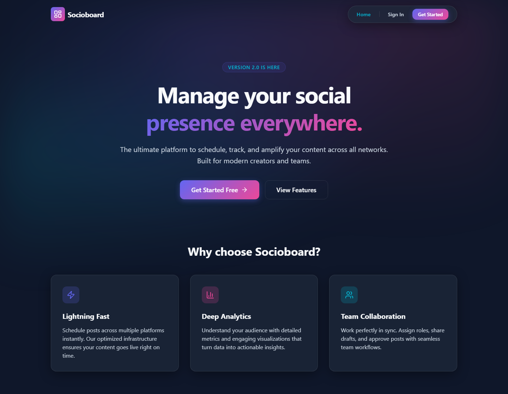
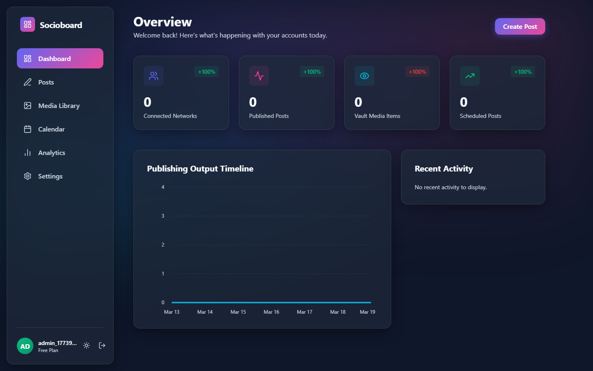
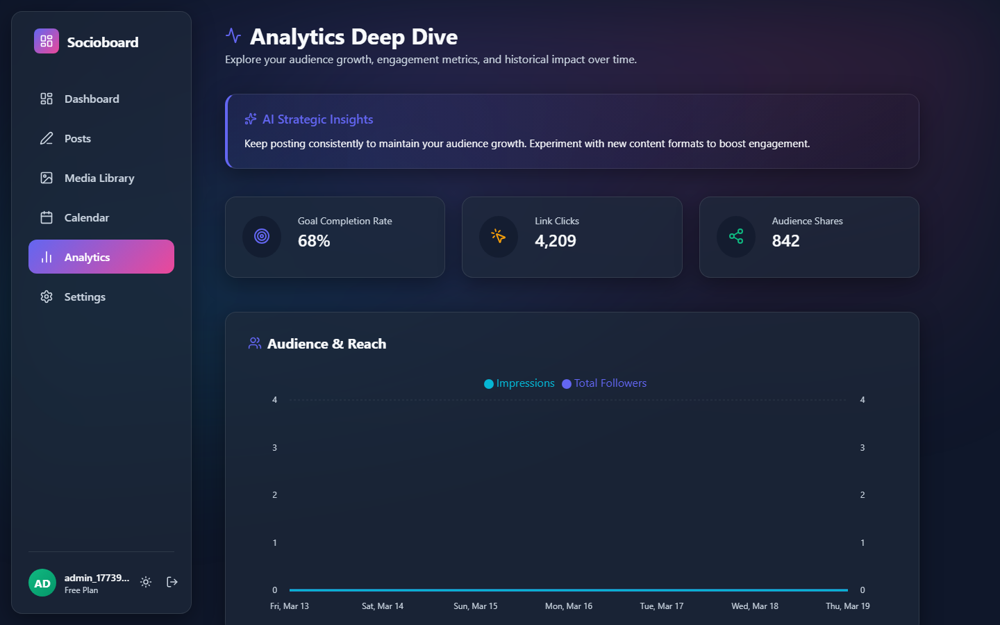
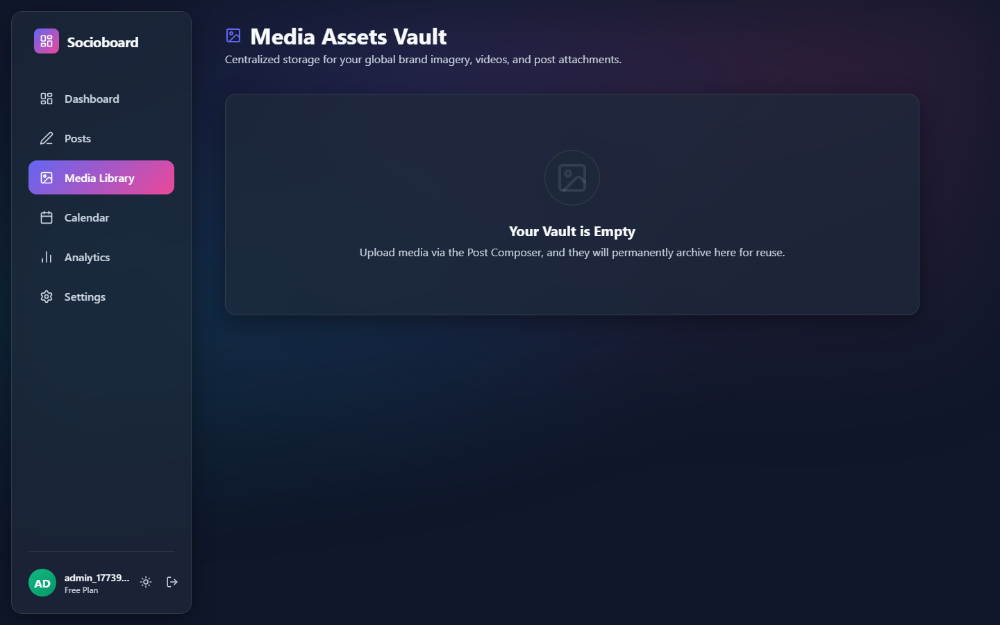
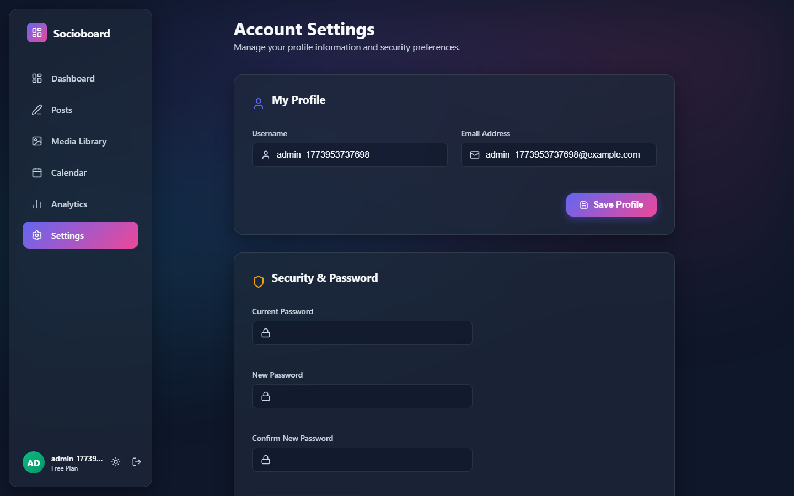
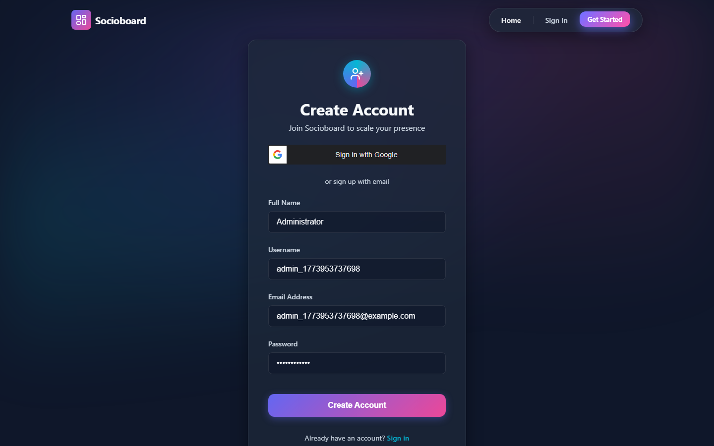
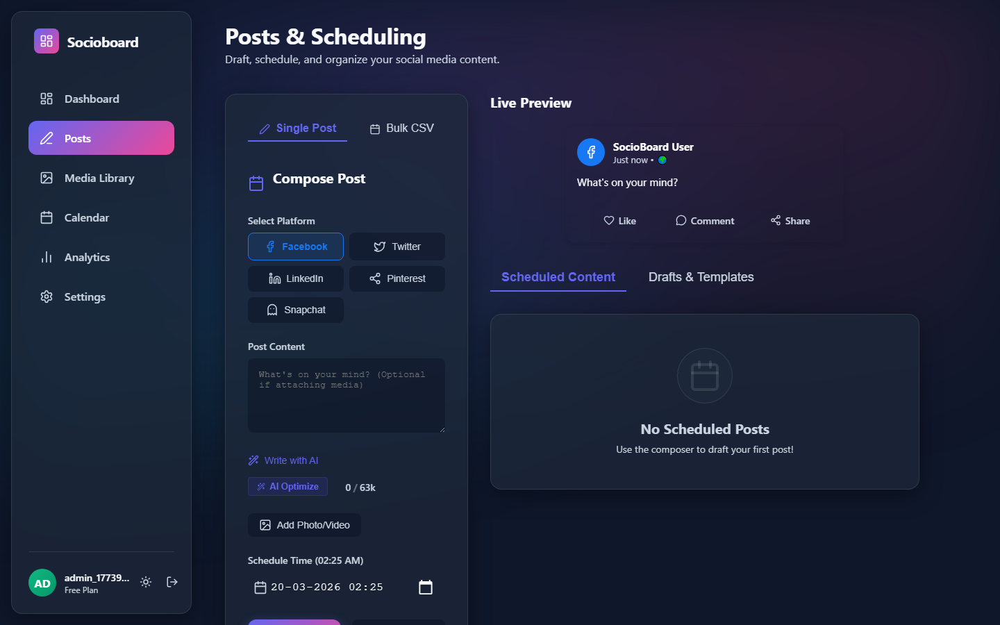

# Socioboard - The Ultimate Social Media Management Suite


Socioboard is a fully-featured, modern social media management tool. Designed for individual creators and enterprise teams alike, it allows users to schedule posts, orchestrate massive multi-platform deployments via CSV uploads, manage digital assets, and analyze their audience impact natively.

---

## ✨ Features

- **Multi-Platform Native Integrations**:
  - 📘 **Facebook**: Post organically to multiple Pages natively.
  - 🐦 **Twitter / X**: Distribute tweets seamlessly utilizing OAuth 2.0 PKCE.
  - 💼 **LinkedIn**: Share rich feeds and digital asset recipes flawlessly.
  - 📌 **Pinterest**: Automate pin delivery and custom board selection.
  - 👻 **Snapchat Business**: Tap right into the mobile audience by executing Spotlight deployments from your desktop!

- **Composer & Bulk Deployments**: 
  - Effortlessly construct posts, or drop in massive `.csv` data-sets with predefined scheduled times, images, and target network identifiers.

- **Dynamic Analytics Dashboard**:
  - Recharts-powered graphs track **Audience Reach**, **Engagement Profiles**, and **Vault Utilization**.
  - Powered by **AI Strategic Insights** - Automated advice derived directly from your growth trajectories.

- **Asset Vault Storage**: 
  - Manage images and video directly inside your personal bucket with 1-click publishing integration.
  - **AWS S3 Enabled**: Effortlessly binds your bucket for scalable global delivery, or falls back to local storage routing.

- **Secure Identity Management**:
  - OAuth login handlers for streamlined onboarding (Google Auth natively supported).
  - Encrypted credential handling (AES-256 equivalent vaulting) inside the database.

---

## 🛠️ Stack Architecture

* **Frontend**: React 18 + Vite, Tailwind CSS (Custom System), Playwright E2E Tests.
* **Backend**: Python 3.14 + FastAPI + Pydantic.
* **Databases**:
  * **MySQL/SQLite**: User Identity, Account Connections, Telemetry schemas.
  * **MongoDB (Async)**: Post Data, S3 Vault Document mapping.
* **Infrastructure**: Nginx load balancing natively contained in an orchestration-ready Docker build.

---

## 🚀 Quick Start Deployment Guide

To deploy Socioboard locally, follow these straightforward steps:

### 1. Requirements
* Docker Desktop installed (or raw engines via Linux)
* Node.js v19+ (Optional for local execution without Docker)
* Python 3.14+ (Optional for local execution without Docker)

### 2. Environment Configurations
Rename `.env.example` configurations to `.env` in the global `backend` directory.

Example Keys required for production:
```env
# Essential Credentials
SECRET_KEY=generate_a_random_32-character_key
ENCRYPTION_KEY=generate_a_random_32-character_key_for_db_crypto

# AWS Vaulting 
AWS_ACCESS_KEY_ID=xxx
AWS_SECRET_ACCESS_KEY=xxx
AWS_S3_BUCKET_NAME=your_bucket
AWS_REGION=us-east-1

# OAuth Network Connections 
FACEBOOK_APP_ID=xxx
FACEBOOK_APP_SECRET=xxx

TWITTER_CLIENT_ID=xxx
TWITTER_CLIENT_SECRET=xxx

LINKEDIN_CLIENT_ID=xxx
LINKEDIN_CLIENT_SECRET=xxx

PINTEREST_APP_ID=xxx
PINTEREST_APP_SECRET=xxx

SNAPCHAT_CONFIDENTIAL_CLIENT_ID=xxx
SNAPCHAT_CLIENT_SECRET=xxx
```

### 3. Spin Up Docker Compose!
Navigate to the root directory where `docker-compose.yml` is located, and execute:

```bash
docker-compose up --build
```
* **Frontend**: Bound natively to `http://localhost:5173`
* **Backend API**: Dispatched to `http://localhost:8000`

> Note: Social Network OAuth pathways frequently require valid SSL web endpoints to successfully register callbacks. Using a tool like `ngrok` mapped to your `8000` port handles those seamlessly in development modes!

---

## 🧪 Testing Environment

We maintain strict coverage checking to safely deploy changes directly from local pipelines:

### Executing Backend Infrastructure Checks:
The API engine boasts comprehensive PyTest suites across all route controllers (Auth, Posts, Vault Media, Analytics, Database connectivity).
```bash
cd backend
python -m pytest tests/ -v
```

### Executing Frontend Browser E2E Simulations:
UI functionality flows run physically on headless Chromium browsers managed natively by Playwright.
```bash
cd frontend
npx playwright test tests/
```

---

*Engineered with precision for dynamic, cross-network orchestrations.* Happy Posting!

---

## 🖼️ Application Gallery

Here is a glimpse of the Socioboard interface in action:

### 1. Landing Page


### 2. Dashboard Overview


### 3. Analytics Deep Dive


### 4. Media Vault & Uploader


### 5. Settings & Social Integrations


### 6. Authentication & Registration


### 7. Content Composer & Scheduling

